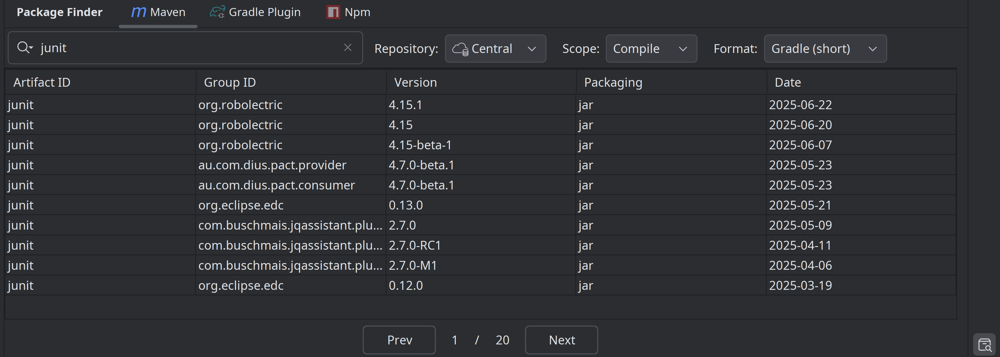
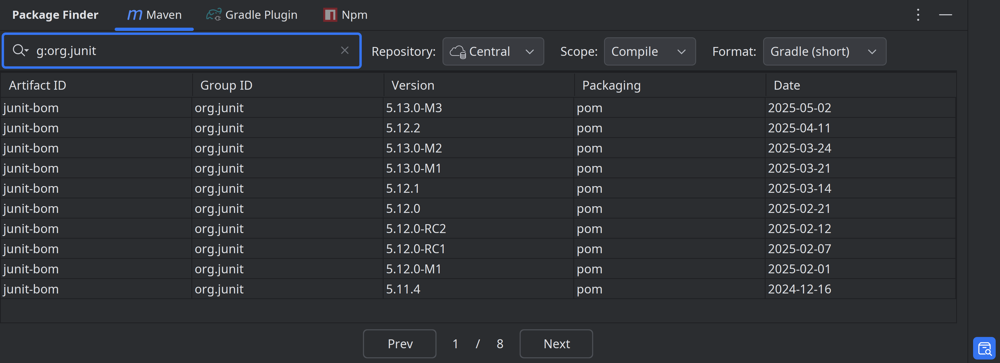
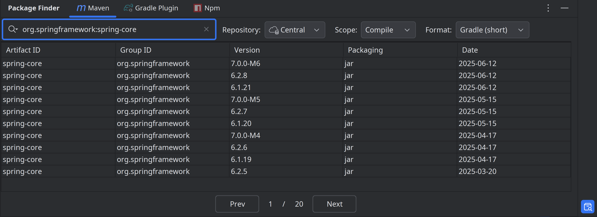
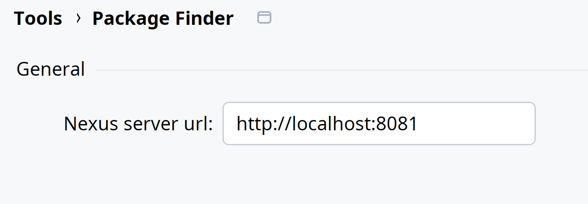
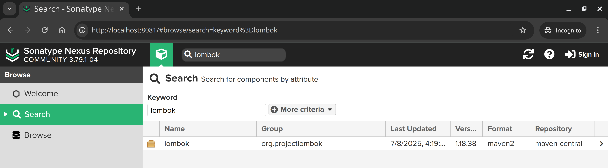
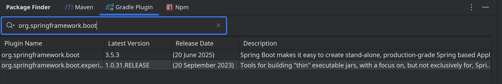
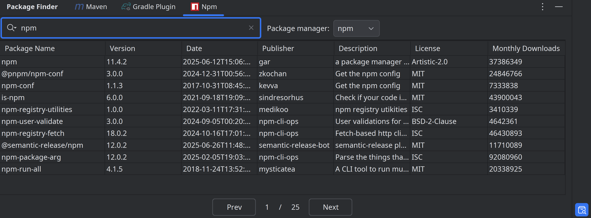

    

<h1 align="center">Package Finder</h1>

IntelliJ plugin for package/dependency search (Maven, Gradle, etc.)

 

English | [简体中文](./README_cn.md)

- [Installation](#Installation)
- [Search from Maven Central](#search-from-maven-central)
- [Explore Local Maven Repository](#explore-local-maven-repository)
- [Search Private Nexus Repository](#search-private-nexus-repository)
- [Gradle Plugin Search](#gradle-plugin-search)
- [NPM Package Search](#npm-package-search)

<!-- Plugin description -->

Search packages across multiple repositories with ease.

**Features**

* Maven Dependency Search
    * Search dependencies in Maven Central.
    * Explore local Maven repository.
    * Support Nexus private repository search.
* Search Gradle plugins.
* Search Npm packages.

<!-- Plugin description end -->

**Compatible with version: 2024.2 or later**

## Installation

Simply search for Package Finder in the plugin marketplace, install it, and restart your IDE.

> Alternatively, you can download the ZIP package
> from the [Releases](https://github.com/drawsta/package-finder/releases) page
> and install it manually via **Plugins > Install Plugin from Disk...**.

## Search from Maven Central

- Search by artifact, group, or group:artifact format
- **Double-click** to copy ready-to-use dependency declaration
- **Right-click** to download JAR/sources/POM

search by artifact name

search by group

search by group and artifact

## Explore Local Maven Repository

- Switch to **Local Repository** tab
- **Double-click** to copy dependency
- **Right-click &gt; Show in Explorer**

## Search Private Nexus Repository

- Configure Nexus URL in plugin's settings: <kbd>Settings</kbd> > <kbd>Tools</kbd> > <kbd>Package Finder</kbd>
- Search your private repository *(requires Nexus server to allow anonymous search API access)*

## Gradle Plugin Search

Search by tag or keywords

## NPM Package Search

- Search npm packages
- **Double-click** to copy install command (supports npm/yarn/pnpm)

## Change log

Please see [CHANGELOG](CHANGELOG.md) for more information what has changed recently.

## Compatibility Notes

- ✔️ **Supported**: IntelliJ IDEA 242.0 — 252.*
- ❌ **Incompatible**:
    - Versions ≤ 241 (Missing `HttpConnectionUtils` class)
    - Versions ≤ 233 (API changes in `TextComponentEmptyText` and `HttpConnectionUtils`)

## License

Please see [LICENSE](LICENSE) for details.
