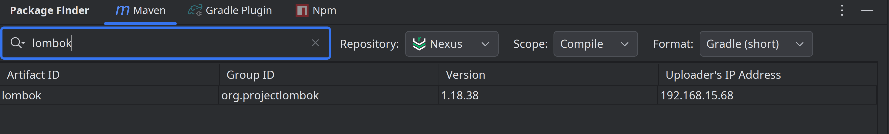

# Package Finder

<!-- Plugin description -->

Search packages across multiple repositories with ease.

**Features**

* Maven Dependency Search
    * Search dependencies in Maven Central.
    * Explore local Maven repository.
    * Support Nexus private repository search.
* Search Gradle plugins.
* Search Npm packages.

<!-- Plugin description end -->

## Tutorial

### Search dependencies

（1）Central repository

search by artifact name

search by group

search by group and artifact

（2）Local repository

（3）Nexus

### Search Gradle plugin

### Search Npm packages

