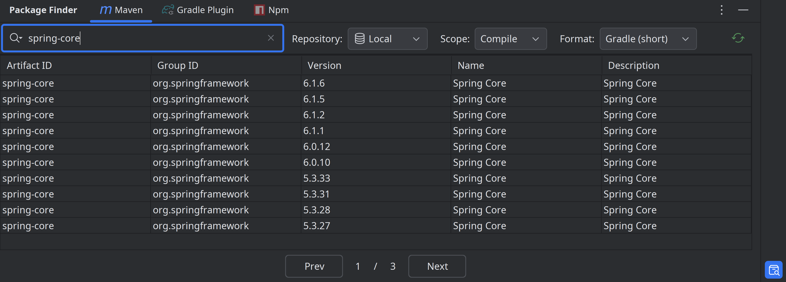
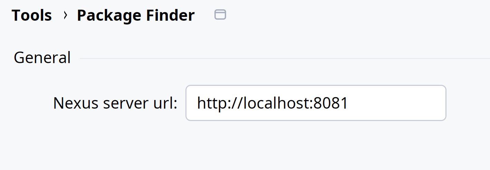
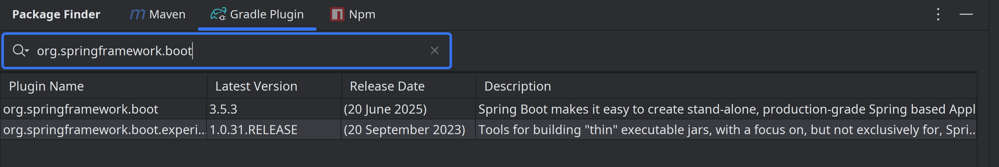

    

<h1 align="center">Package Finder</h1>

Intellij 依赖包搜索插件，支持搜索 Nexus 私服和 Gradle 插件

 

简体中文 | [English](./README.md)

- [插件介绍](#插件介绍)
- [从 Maven Central 仓库搜索](#从-maven-central-仓库搜索)
- [搜索本地 Maven 仓库](#搜索本地-maven-仓库)
- [Nexus 私服搜索](#nexus-私服搜索)
- [Gradle 插件搜索](#gradle-插件搜索)
- [NPM 包搜索](#npm-包搜索)

## 插件介绍

核心功能：Sonatype Maven 中央仓库依赖搜索，复制依赖声明语句（支持 Gradle 和 Maven 格式）

适配版本：**2024.2+ 版本**

附加功能：

* 下载 JAR 包、源码包、POM 文件
* 搜索本地 Maven 仓库，一键打开依赖所在目录
* Nexus 私服依赖搜索（需要私服设置允许匿名 API 访问，本人所在公司的私服 API 响应的就是空结果，或许这就是为什么那么多早就发布的插件不支持这个功能的原因，做了也白做）
* Gradle 插件搜索
* NPM 包搜索

题外话：

1. 现在 AI 助手插件盛行，为什么还要开发这个插件呢？
   为了自用和学习，不想切到浏览器搜索依赖版本，AI 没那么及时获取最新版本，方便快速复制依赖声明语句，
   同时学习下 Kotlin 和 Intellij 插件开发的流程，反正闲着也是闲着。

2. 插件市场已有不少 Maven 依赖搜索插件，比如 search in repository、maven search，
   对比有什么特别的呢，主要就是支持 Nexus 私服和 Gradle 插件搜索。
   这两者都是开源的，不过后者搜索算法强大，能很好地匹配你想要的依赖，但都不支持 Maven 私服搜索。
   Package Finder 是在参考 search in repository 及众多其他开源插件后，精简功能而来，在此感谢。

## 用法说明

安装就不用说了，插件市场直接搜索 package finder，安装后重启 IDEA 即可。

需要注意的是，目前版本只支持 2024.2+ 版本，2024.2 以下版本不支持的原因是，
用了较新的一个 Http 请求 API，主要是方便使用 IDE 配置里的代理，如果配置了的话，
因为中央仓库和 Gradle 插件的搜索 api 服务，大陆有时是不太好访问的，需要代理。
或许可以单独适配个旧版本，不用 IDE proxy，自行解决代理问题。

### 从 Maven Central 仓库搜索

- 搜索格式：`artifact, group, or group:artifact format`
- 双击复制依赖声明（可选 Maven、Gradle 格式及依赖作用域）
- 右击菜单，显示下载 JAR/sources/POM

search by artifact name

search by group

search by group and artifact

### 搜索本地 Maven 仓库

- 双击复制依赖声明（Maven、Gradle 格式）
- 右键菜单打开依赖所在目录

### Nexus 私服搜索

安装后，配置私服服务器地址：<kbd>Settings</kbd> > <kbd>Tools</kbd> > <kbd>Package Finder</kbd>

### Gradle 插件搜索

Search by tag or keywords

### NPM 包搜索

- 双击复制包安装命令（支持 npm/yarn/pnpm）

## Change log

Please see [CHANGELOG](CHANGELOG.md) for more information what has changed recently.

## Compatibility Notes

- ✔️ **Supported**: IntelliJ IDEA 242.0 — 252.*
- ❌ **Incompatible**:
   - Versions ≤ 241 (Missing `HttpConnectionUtils` class)
   - Versions ≤ 233 (API changes in `TextComponentEmptyText` and `HttpConnectionUtils`)

## License

Please see [LICENSE](LICENSE) for details.
